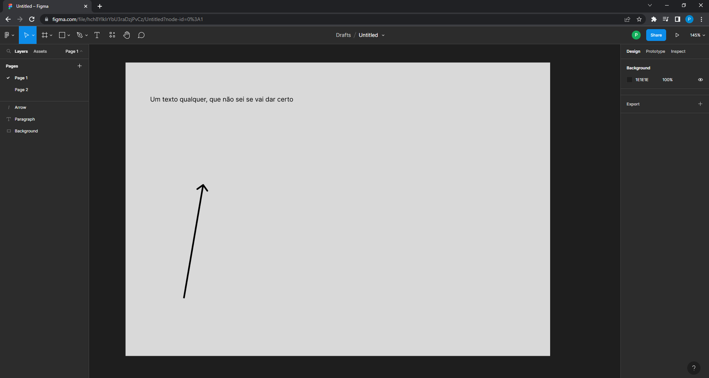
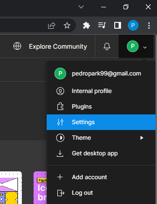

```{r, include = FALSE}
knitr::opts_chunk$set(
  collapse = TRUE,
  comment = "#>"
)
```


# 1. Introduction

You might have some Figma files that you want to bring into R, to analyse, or, use the visual attributes
of the objects from this file to compose a layout that you want to use in a RMarkdown/Quarto file.

The `figma` package allows you to that. It uses the Figma API to bring all of your Figma file data into R.
It does this, by sending a HTTP request to the Figma API to collect all of your Figma data, and then,
it parses this data into a R native object, so you can easily use it in your R process.

```{r setup, eval = FALSE}
library(figma)
```

But in order to use the Figma API, you need to collect two key variables about your file and your credentials. 
They are:

- `file_key`: The ID (or the "key") that identifies your Figma file;
- `token`: Your personal access token from the Figma platform;

However, if you want to use `get_figma_page()`, you will need to collect a third information,
which is the `node_id`, or the ID that identifies a canvas/page of your Figma file. We will talk about this ID on section 1.2.

## 1.1 Is always nice to read the official Figma API documentation

Some of the information described in this vignette comes from the official Figma API documentation, and
in order to learn more about a specific subject, is always a good idea to read about that subject
directly from the source `r emoji::emoji("winking_face")`.

I will give you direct links to specific parts of the documentation throughout this vignette,
but if you want to read the complete documentation, you can access
[this link](https://www.figma.com/developers/api).

## 1.2 Findind the key (or ID) of your Figma file

The file key (or the file key), is a random text that identifies your Figma
file. The Figma API uses this key to identify which specific Figma file you
are requesting for.

You can find the key (or ID) of your Figma file by looking at the URL in your web browser, when you access your Figma file
at the Figma platform. As an example, lets use this Figma file entitled `Untitled` (I will not make a joke on that 
`r emoji::emoji("sweat_smile")`):

```{r file_example, echo = FALSE, fig.cap = "An example of Figma file"}

```

If we look at the top of my web browser, we have the following URL:

`https://www.figma.com/file/hch8YlkIrYbU3raDzjPvCz/Untitled?node-id=0%3A1`

The key (or the ID) of this file is `"hch8YlkIrYbU3raDzjPvCz"`. This means
that the URL of every Figma file is composed of this sctructure. So in
order to use the functions from the `figma` package, you should always
collect this `:file_key` portion of the URL, to get the key to your
file.

`https://www.figma.com/file/:file_key/:file_title?:node_id`

This also means that, if you want to use `get_figma_page()`, you will need
to collect the `:node_id` portion of the URL as well. This portion gives you the
node ID, or, in other words, the ID that identifies the canvas/page you are on.
This portion of the URL is usually a key-value pair, where the ID of your node is after the equal sign (`=`).

For example, by looking at the URL example that we gave above, we know that the
canvas/page where I am is the page of `node_id = "0%3A1"`.


## 1.3 Get your personal access token

You can read more about the authentication process and the use of personal
access tokens, in [the section "Authentication" of the Figma API documentation](https://www.figma.com/developers/api#authentication).
If you do not have a personal access token, you can create one in the Figma
platform. Just log in the platform, and click on the `Settings` section, like
in the image below:

```{r, echo = FALSE, fig.cap = "Settings of Figma platform"}

```

After that, look for the `Personal access token` section of the settings, like in
the image below. This is where you can create all of your personal access tokens. Just
add a description (or a "alias") to your token, and press Enter. A pop-up should appear
in your screen with your new token.

```{r, echo = FALSE, fig.cap = "Personal access token section in settings"}
knitr::include_graphics("create-token.png")
```

The Figma API uses this secret token to identify you, to know that is you that is requesting
for a file, and not someone else. Because of this, is important to keep this token a secret,
because if someone have it, they can access your Figma files through the API.

A standard way to store these passwords, is to store them in the `.Rprofile` file, but there are
many other methods that are good alternatives too. A good place to start is the 
[vignette from Hadley Wickham](https://cran.r-project.org/web/packages/httr/vignettes/secrets.html).


## 1.4 Use `get_figma_file()` to get your Figma file 
Now that you have the key (or ID) that identifies your Figma file, and your personal token that
identifies yourself, you can use `get_figma_file()` to get your Figma file:

```{r, eval = FALSE}
file_key <- "hch8YlkIrYbU3raDzjPvCz"
# Insert your personal token:
token <- "Your personal token ..."

result <- figma::get_figma_file(
  file_key, token
)
# A `response` object:
print(result)
```

```
Response [https://api.figma.com/v1/files/hch8YlkIrYbU3raDzjPvCz]
  Date: 2022-10-29 16:56
  Status: 200
  Content-Type: application/json; charset=utf-8
  Size: 4.58 kB
{"document":{"id":"0:0","name":"Document","type":"DOCUMENT","children":[{"id":"0:1","name":"Page 1","typ...
```


## 1.5 Using the `response` object

The functions from `figma` package have the philosophy of giving (by default) the most raw and unprocessed
result as possible to the user. This is good for debugging situations, because it gives
all the available information to the user.

However, this unprocessed result is usually not strucutured in a very friendly and useful format,
which makes analysis and transformation pipelines harder and more complex. That is why 
`get_figma_file()` comes with more output formats available through the `.output_format` argument,
which we will describe later.

To give you an useful example, you can access the exact `response` object shown in the example
of section 1.4. This `response` object is stored in a object called `untitled_file`,
that you can access with `figma::untitled_file`. This object `untitled_file` contains all
of the data from the Figma file shown in section 1.2.

As you can see in the result below, a `response` object is just a simple R list with many
elements:

```{r}
str(figma::untitled_file)
```

All of your Figma file data is in the `content` element, so, you would use the 
command `figma::untitled_file$content` to access it. But, by default, the Figma API sends
the data of your Figma file as raw bytes:

```{r}
head(figma::untitled_file$content)
```

So you need to convert these bytes in a more useful format like a JSON object, or a character
vector, or as pure text. To do this conversion, I recommend you to use the `httr::content()`
function. By default, this function converts the raw bytes into a R list.

```{r}
list_of_nodes <- figma::untitled_file |>
  httr::content()

names(list_of_nodes)
```

The canvas/pages nodes are in the `list_of_nodes$document$children` element, and the
objects nodes are in the `children` element of each canvas/page node (e.g. 
`list_of_nodes$document$children[[1]][["children"]]`).

```{r}
first_canvas_node <- list_of_nodes$document$children[[1]]
first_object_node <- first_canvas_node[["children"]][[1]]
```

## 1.6 Output a Figma Document object

With `.output_argument = "figma_document"`, `get_figma_file()` will output a Figma Document object,
instead of a `response` object.

```{r, eval = FALSE}
file_key <- "hch8YlkIrYbU3raDzjPvCz"
# Insert your personal token:
token <- "Your personal token ..."

figma_document <- figma::get_figma_file(
  file_key, token,
  .output_format = "figma_document"
)
# A `figma_document` object:
print(figma_document)
```

Or, analogously:

```{r}
figma_document <- figma:::as_figma_document(figma::untitled_file)
figma_document
```

This object is just a R list with class `figma_document`. The main differences between this object and 
the `response` object are:

- the `figma_document` object have only data about your Figma file (i.e. no data about the HTTP request made to the Figma API);
- the data of your Figma file is a little more organized in the `figma_document` object;

In a `figma_document` object, all of the document metadata of your Figma file (like the name/title of 
the file, the last time it was modified, its components, etc...) is available in the 
`document` element:

```{r}
str(figma_document$document)
```

Furthermore, you can get the data of each canvas/page (and their respective objects) in the `canvas`
element:

```{r}
names(figma_document$canvas[[1]])
```

And the data of all the objects present in each canvas is found in the `objects` element:

```{r}
first_canvas_node <- figma_document$canvas[[1]]
first_object_node <- first_canvas_node$objects[[1]]
str(first_object_node)
```


## 1.7 Output a `tibble::tibble()` object

With `.output_format = "tibble`, `get_figma_file()` will output a `tibble::tibble()` object, instead of 
a `response` object. This is probably the most useful and friendly output format that you can use:

```{r, eval = FALSE}
file_key <- "hch8YlkIrYbU3raDzjPvCz"
# Insert your personal token:
token <- "Your personal token ..."

tibble <- figma::get_figma_file(
  file_key, token,
  .output_format = "tibble"
)
# A `tibble` object:
print(tibble)
```

Or, analogously:

```{r}
tibble <- figma::as_tibble(figma::untitled_file)
tibble
```

Each row in the resulting tibble, is a object present in one of the canvas of your Figma file.
As an example, the Figma file stored in `figma::untitled_file` have 2 canvas/pages: 3 objects in 
the first canvas, and 2 objects in the second canvas. So 3 objects + 2 objects = 5 rows in the 
output tibble.

The columns with `canvas_` prefix stores the metadata about the canvas on which the object of the
corresponding row is. And the columns with `object_` prefix stores the data about the object of the
corresponding row. 

Each object can have a different type (it can be a RECTANGLE, a TEXT, a VECTOR, etc.),
and different types of objects usually have different kinds of attributes. The attributes of each
object are stored in the `object_attributes` column.


<!-- # 2 The structure of a Figma file -->

<!-- A Figma file is represented as a tree of nodes. is composed of a set of canvas (or pages), and  -->
<!-- each canvas contains a set of multiple objects. So, the canvas is the visual space where you draw,  -->
<!-- and, each object represents a layer, or, a visual element that you add to this space. -->

<!-- Each object that you add can be of a different type (like TEXT, RECTANGLE, VECTOR, etc.).  -->
<!-- But each canvas is always. -->
