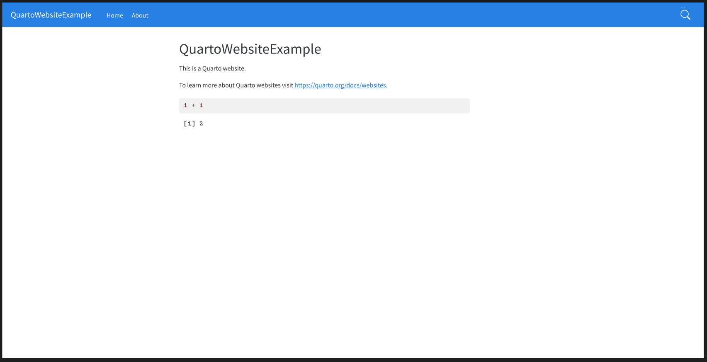

```{r, include = FALSE}
knitr::opts_chunk$set(
  collapse = TRUE,
  comment = "#>"
)
```


## Introduction

Hello! In this vignette, I will show you a basic example of how you could use the data from the Figma API, to produce custom CSS code, which you could use it in a design product, such as a website. First, lets import the package. After that, the `quarto_website` object will be available for you like this:

```{r setup}
library(figma)
quarto_website
```

## About the `quarto_website` object

The `quarto_website` object is a `response` object produced by `figma::get_figma_file()`, so, it contains all data from a Figma file. In this Figma file, I have drawn a homepage for a [Quarto](https://quarto.org) Website. Below we have a screenshot of this Figma file:

```{r, echo = FALSE, fig.cap = 'A screenshot of a Figma file named "Quarto-Website"', out.width="100%"}

```


